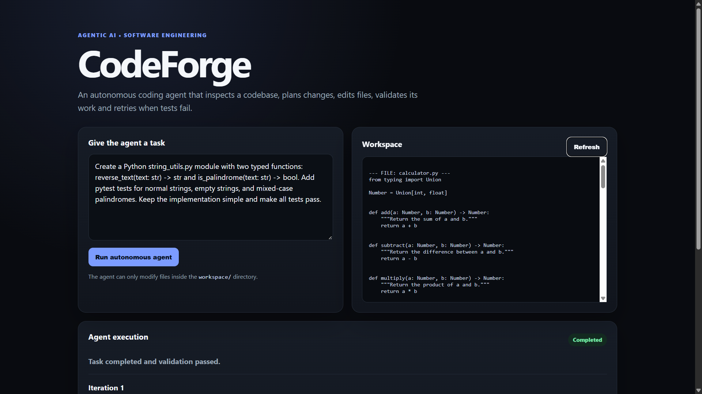
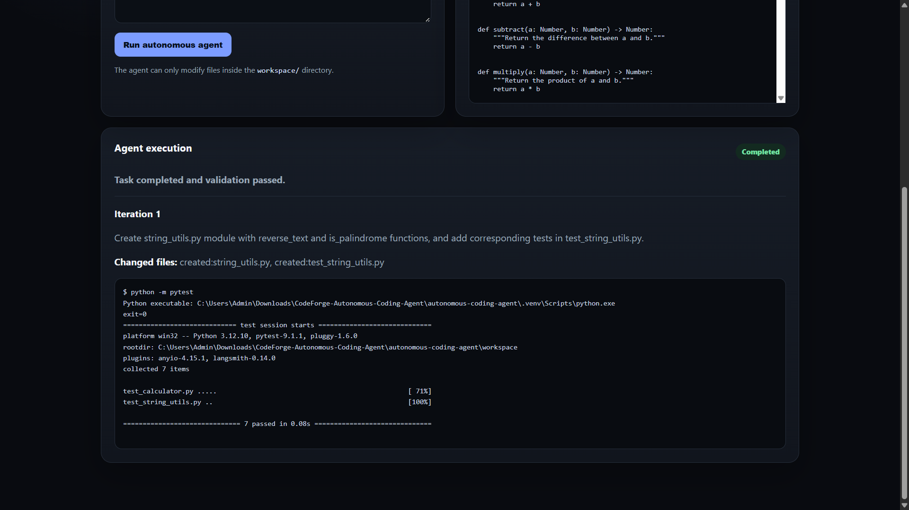

# CodeForge — Autonomous Coding Agent

CodeForge is an **agentic AI coding system** that works directly on an existing project workspace.

Instead of only generating code as text, CodeForge can inspect project files, understand a coding task, plan changes, create or update code, generate tests, run validation automatically, and retry when something fails.

In simple terms, CodeForge acts like a small autonomous software engineer.

---

## What It Does

CodeForge can:

- read an existing codebase
- understand a coding task
- create new files
- update existing files
- generate pytest tests
- run validation automatically
- use test failures as feedback
- retry with corrected code
- mark a task complete only after validation succeeds

---

## How It Works

```text
Task
 ↓
Inspect workspace
 ↓
Plan changes
 ↓
Edit files
 ↓
Generate tests
 ↓
Run validation
 ↓
Pass → Complete
Fail → Fix → Retry
```

CodeForge works only inside the controlled `workspace/` directory, so the agent cannot modify arbitrary files on the computer.

---

## Tech Stack

**Python · LangGraph · Google Gemini API · FastAPI · Pydantic · Pytest · HTML · CSS · JavaScript · Docker · Git · GitHub**

---

## Demo

### CodeForge Interface



### Successful Autonomous Validation



---

## Example Task

```text
Create a Python string_utils.py module with two typed functions:

reverse_text(text: str) -> str
is_palindrome(text: str) -> bool

Add pytest tests for normal strings, empty strings,
and mixed-case palindromes.

Keep the implementation simple and make all tests pass.
```

For this task, CodeForge automatically:

- inspected the existing workspace
- created `string_utils.py`
- created `test_string_utils.py`
- ran the full pytest suite
- validated the implementation
- completed the task successfully

Example result:

```text
collected 7 items

test_calculator.py .....
test_string_utils.py ..

7 passed
```

---

## Project Structure

```text
codeforge-autonomous-coding-agent/
│
├── app/
│   ├── agent.py
│   ├── config.py
│   ├── llm.py
│   ├── main.py
│   ├── models.py
│   ├── workspace.py
│   │
│   ├── static/
│   │   ├── app.js
│   │   └── style.css
│   │
│   └── templates/
│       └── index.html
│
├── assets/
│   ├── codeforge-dashboard.png
│   └── codeforge-validation.png
│
├── tests/
│   └── test_workspace.py
│
├── workspace/
│   ├── calculator.py
│   ├── string_utils.py
│   ├── task_manager.py
│   ├── test_calculator.py
│   ├── test_string_utils.py
│   └── test_task_manager.py
│
├── .env.example
├── .gitignore
├── Dockerfile
├── docker-compose.yml
├── requirements.txt
├── run_windows.bat
└── run_mac_linux.sh
```

---

## How to Run

### 1. Clone the repository

```bash
git clone https://github.com/shilpasiddaraj494-pixel/codeforge-autonomous-coding-agent.git
cd codeforge-autonomous-coding-agent
```

### 2. Create a `.env` file

Use `.env.example` as the template.

Add:

```text
GEMINI_API_KEY=your_gemini_api_key
GEMINI_MODEL=your_available_gemini_model
MAX_ITERATIONS=3
```

Do not commit your real `.env` file.

### 3. Run on Windows

```powershell
.\run_windows.bat
```

Or:

```powershell
.\.venv\Scripts\python.exe -m uvicorn app.main:app --host 127.0.0.1 --port 8001
```

Then open:

```text
http://127.0.0.1:8001
```

---

## Safety

CodeForge is intentionally restricted.

- file changes are limited to `workspace/`
- path traversal outside the workspace is rejected
- arbitrary shell commands are blocked
- only approved validation commands are allowed
- autonomous retries are limited

Supported validation commands include:

```text
pytest
python -m pytest
python -m unittest
python -m compileall .
```

---

## Summary

CodeForge demonstrates how an LLM can be used inside a **controlled autonomous software-engineering workflow**.

Instead of simply returning code, the system can:

**inspect → plan → edit → test → validate → retry → complete**

This makes CodeForge a practical example of **agentic AI applied to software development**.